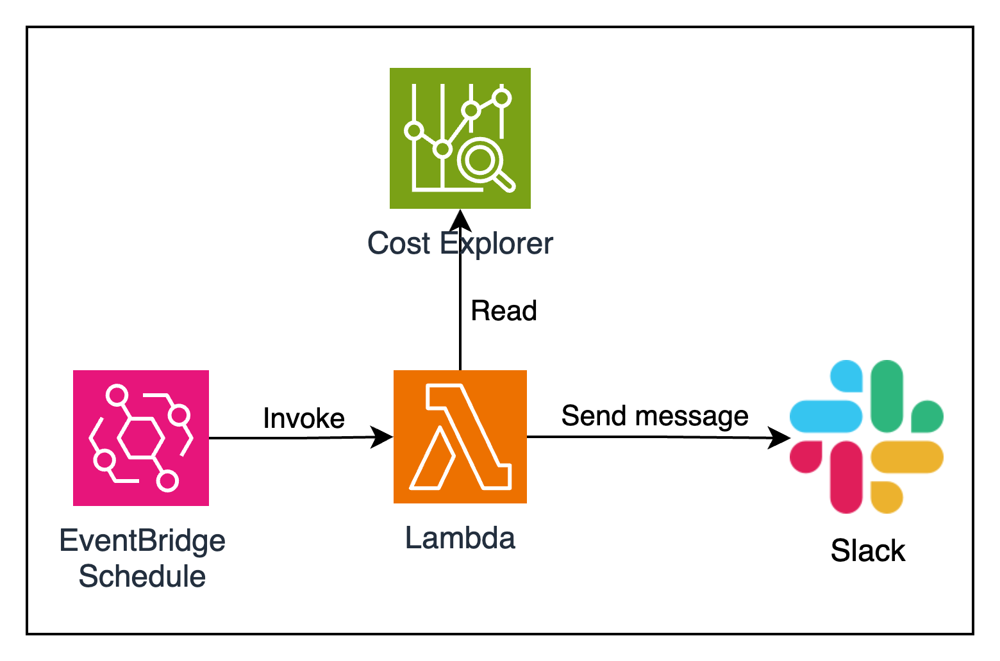
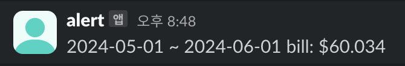

# AWS 비용 데일리 리포트
: 매일 오전 9시에 Cost Explorer 에서 월 비용 조회 후 슬랙으로 리포트 메시지 전송

- AWS Lambda
- AWS EventBridge > Schedule

#### AWS 리소스 구성도

#### SLACK 메세지

## python 코드 테스트
### 의존성 설치
> pip install boto3

> pip install slack_sdk

### 실행
> TZ=UTC SLACK_BOT_TOKEN=".." SLACK_CHANNEL=".."  python templates/main.py