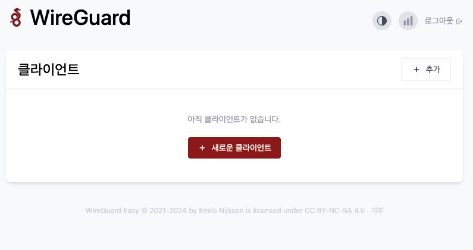

# Wireguard 서버
: wg-easy 프로젝트를 활용한 Docker 기반 Wireguard VPN 서버 구축 

- AWS Lightsail
- Docker
  - [wg-easy](https://github.com/wg-easy/wg-easy)

## 1. Prerequirements
1. Lightsail 인스턴스용 Keypair 생성

    > $ mkdir -p ssh

    > $ ssh-keygen -t rsa
    
    - 키 파일 생성 시 경로는 `<wireguard-server terraform 모듈 경로>/ssh/lightsail_key` 로 지정 필요

## 2. 프로비저닝
> $ terraform init

> $ terraform apply

### 고려 사항
현재 Lightsail 인스턴스가 생성되고 내부적으로 도커가 실행될 때까지 약간의 시간이 소요되어, docker-compose 를 통한 wireguard 서버 실행 remote-exec 가 실패할 수 있음
- 이럴 때는 다시 한번 terraform apply 를 통해 remote-exec 를 다시 실행해주면 정상적으로 wireguard 서버 실행까지 완료됨. 

## 3. wireguard UI 접근
- `http://<Lightsail Static IP 주소>:51821`

